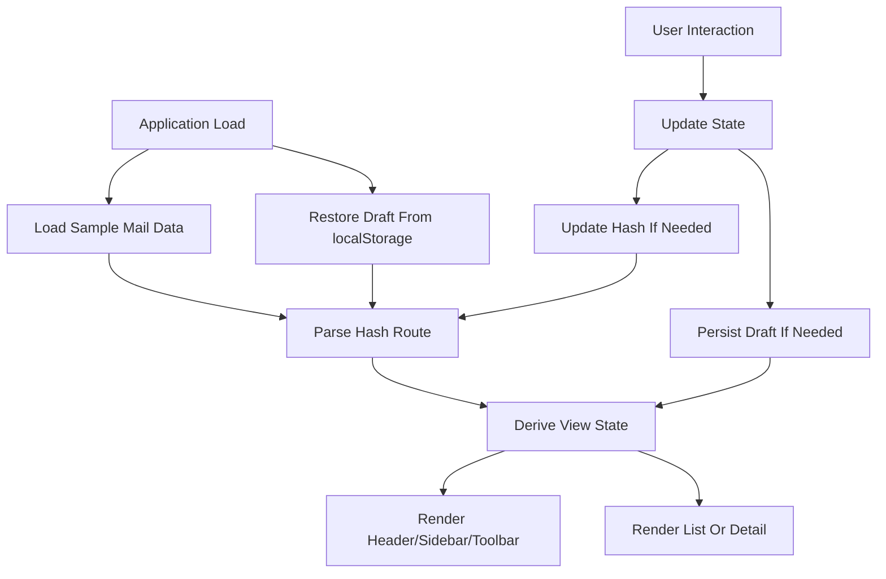

# Design

### [DESIGN] - Technical Plan - 2026-04-22T00:00:00Z
**Objective**: Gmail 風静的 UI の実装方針、構造、データフロー、エラー処理、検証戦略を定義する。
**Context**: [spec/requirements.md](spec/requirements.md) に機能要件を整理済み。プロジェクトは静的サイトであり、フレームワークは利用しない。
**Decision**: データ、状態、描画、イベントを分離した複数 JS ファイル構成を採用し、Hash ルーティングでビュー遷移を行う。
**Execution**: 既存の [plan-gmail.md](plan-gmail.md) に記載されたファイル構成をベースに、責務分割、状態遷移、エラー処理、テスト戦略を明文化した。
**Output**: アーキテクチャ、インターフェース、データモデル、エラーマトリクス、検証方針を文書化した。
**Validation**: 要求との対応関係を確認し、主要機能ごとに実装責務の重複がないことを確認した。
**Next**: [spec/tasks.md](spec/tasks.md) に実装順序と依存関係を展開する。

### Decision - 2026-04-22T00:00:00Z
**Decision**: 単一 HTML に対して CSS と JS を責務別に分割する静的 SPA 風構成を採用する。
**Context**: 小規模な UI 試作でありながら、受信トレイ、詳細、検索、Compose など複数ビューと状態遷移を持つ。
**Options**: 1) 単一ファイルに集約 2) CSS/JS を責務別分割 3) 軽量フレームワーク導入。
**Rationale**: 2) は既存プランと整合し、静的サイトとして十分シンプルでありながら、描画・状態・イベントの分離で保守性を確保できる。1) は初期実装は速いが可読性が低くなり、3) は要件に反する。
**Impact**: 実装は少数ファイルに分散するが、要件変更時の追従が容易になる。
**Review**: 主要機能実装後に責務分割が過剰でないか見直す。

## Adaptive Execution Strategy

- Confidence Score は 88% のため High Confidence と判定する
- PoC を挟まず、spec 定義後に本実装へ進む
- 実装は依存順に段階的に進め、各段階で軽量検証を行う

## Architecture

### Files And Responsibilities

- [index.html](index.html)
  - アプリシェル
  - ヘッダー、サイドバー、ツールバー、コンテンツ領域、Compose マウントポイントを定義
- [css/base.css](css/base.css)
  - リセット、CSS 変数、基本タイポグラフィ
- [css/layout.css](css/layout.css)
  - アプリ全体レイアウト、ヘッダー、サイドバー、メイン領域
- [css/components.css](css/components.css)
  - メール行、ボタン、バッジ、モーダル、空状態、ハイライト
- [js/data.js](js/data.js)
  - サンプルメールデータ生成と下書き初期値
- [js/state.js](js/state.js)
  - アプリケーション状態、現在ルート、検索条件、選択状態、Compose 状態の保持
- [js/render.js](js/render.js)
  - 各ビューの DOM 描画と差し替え
- [js/events.js](js/events.js)
  - イベント委譲、ルート変更監視、ユーザー操作の状態更新

### Component Model

- Header
  - ロゴ
  - 検索フォーム
  - 補助アクション表示
- Sidebar
  - メールボックス遷移
  - 未読バッジ
  - Compose 起動ボタン
- Toolbar
  - 一括操作
  - ページ情報
  - 前後移動
- Mail List
  - メール行反復描画
- Mail Detail
  - メール本文、メタ情報、アクション
- Compose Modal
  - 入力群、送信操作、表示モード制御

## Data Model

```js
{
  id: "001",
  from: { name: "田中 一郎", email: "tanaka@example.com" },
  to: [{ name: "自分", email: "me@example.com" }],
  cc: [],
  bcc: [],
  subject: "プロジェクト進捗報告",
  body: "お疲れ様です。今週の進捗を共有いたします...",
  preview: "お疲れ様です。今週の進捗を共有いたします",
  date: "2026-04-22T10:32:00",
  labels: ["inbox"],
  isRead: false,
  isStarred: false,
  isSelected: false,
  thread: []
}
```

### Application State Shape

```js
{
  route: { name: "inbox", mailId: null, query: "" },
  mails: [],
  currentMailbox: "inbox",
  pagination: { page: 1, pageSize: 50 },
  compose: {
    isOpen: false,
    isMinimized: false,
    isFullscreen: false,
    draft: {
      to: "",
      cc: "",
      bcc: "",
      subject: "",
      body: ""
    },
    error: ""
  }
}
```

## Data Flow



## Routing Design

- `#inbox`
  - 受信トレイ一覧
- `#sent`
  - 送信済み一覧
- `#trash`
  - ゴミ箱一覧
- `#search?q=keyword`
  - 検索結果一覧
- `#mail/:id`
  - メール詳細

### Route Parsing Rules

- 不正または未知の hash は `#inbox` へフォールバックする
- `#mail/:id` は `:id` を文字列 ID として解釈する
- `#search` は `q` パラメータ未指定でも許容し、その場合は空結果または全件検索を明示設計で選ぶ

## Interfaces

### Proposed Module APIs

```js
// data.js
export function createSampleMails() {}
export function loadDraft() {}
export function saveDraft(draft) {}
export function clearDraft() {}

// state.js
export function createInitialState() {}
export function getState() {}
export function setRoute(route) {}
export function updateMail(mailId, updater) {}
export function updateSelection(selectionMode) {}
export function moveToMailbox(mailIds, mailbox) {}
export function updateCompose(patch) {}

// render.js
export function renderApp() {}
export function renderListView() {}
export function renderDetailView() {}
export function renderCompose() {}

// events.js
export function bindEvents() {}
export function handleRouteChange() {}
```

## Search Design

- 通常検索
  - sender, subject, preview, body を部分一致で検索
- `from:` プレフィックス
  - `from:tanaka` のような形式を sender 名または email に適用
- `subject:` プレフィックス
  - 件名のみを対象に部分一致検索
- ハイライト
  - 表示文字列内の一致断片を `<mark>` などで強調

## Error Handling Matrix

| ケース | 検出箇所 | 対応 |
|---|---|---|
| 不正ルート | route parser | `#inbox` にフォールバック |
| 存在しないメール ID | detail selector | 一覧へ戻すか not found 表示 |
| 宛先未入力送信 | compose submit | エラーメッセージを表示して送信中止 |
| localStorage 破損 | draft loader | 例外を握りつぶして初期 draft を利用 |
| 検索文字列が空 | search submit | 空検索として扱い結果文言を調整 |
| 対象なしページ送り | pagination controls | ボタン無効化 |

## Validation Strategy

### Unit-Level Checks

- ルート解析関数が各 hash を正しく解釈するか
- 検索関数が通常検索、`from:`、`subject:` を正しく処理するか
- メール移動、スター切替、既読切替が状態に反映されるか
- 下書き保存と復元が例外時も安全に動作するか

### Manual Verification

- 初期表示で受信トレイが表示される
- サイドバー遷移で一覧が切り替わる
- メール行クリックで詳細へ移動する
- Compose の返信、転送、送信、最小化が動作する
- 検索で結果とハイライトが反映される
- 削除後にゴミ箱で確認できる

### Performance Considerations

- 初回描画は 20 件程度のサンプルデータを前提とし、DOM 再構築のコストは許容範囲
- 一覧操作はイベント委譲を用いて過剰なリスナー登録を避ける
- ページネーションにより大量描画を抑える

## Risks And Mitigations

| リスク | 影響 | 軽減策 |
|---|---|---|
| 単一ページで状態と描画が密結合になる | 保守性低下 | state/render/events を分離する |
| 検索仕様の曖昧さ | 結果不一致 | プレフィックス規則を固定し文書化する |
| localStorage 破損 | Compose 不具合 | try/catch と初期値フォールバック |
| 画面幅不足 | UI 崩れ | 最小幅前提を CSS に明示する |